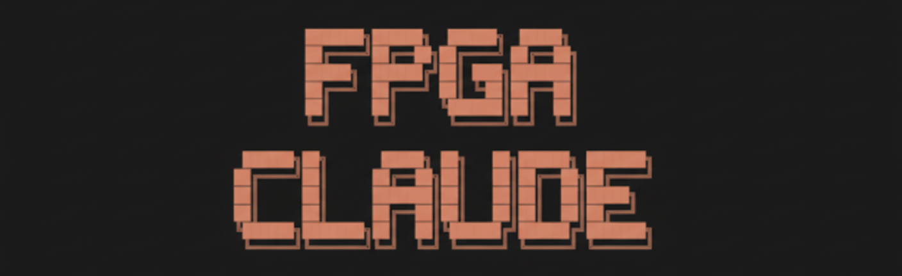
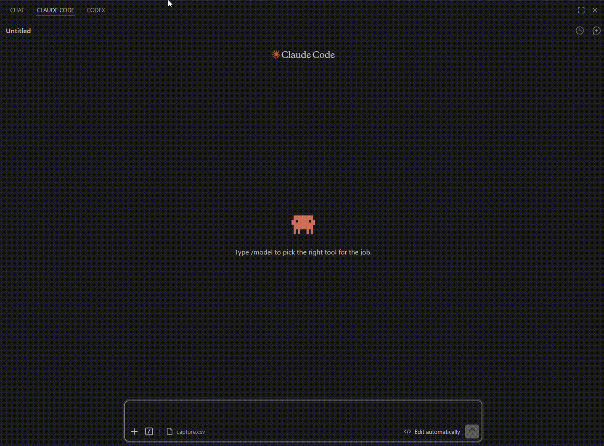
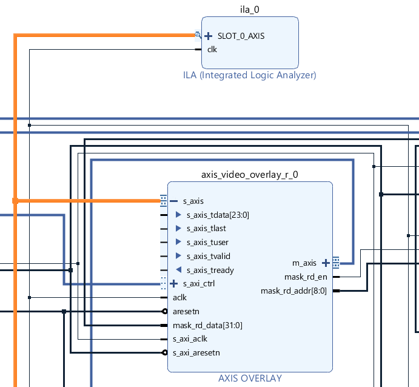

# fpga-claude



[](https://github.com/Nacholazabal/fpga-claude/actions/workflows/ci.yml)
[](https://www.python.org/downloads/)
[](LICENSE)
[](#requirements)
[](https://pypi.org/)

If you work on FPGA firmware, you know the loop: change RTL, rebuild the bitstream, program the board, then switch over to Vivado Hardware Manager to arm the ILA, wait for a trigger, and stare at waveforms to confirm things look right. Every capture means a context switch away from your editor. For straightforward checks ("did the AXI handshake complete?", "is the FIFO draining?"), that overhead adds up fast.

Most of the time, the waveform you're checking is predictable enough that you already know what "correct" looks like. You just need confirmation. That's a task a language model can handle: read the CSV, compare against expected behavior, and tell you if something looks off.

`fpga-claude` is a CLI tool and a pair of Claude Code skills that automate this. It connects to `hw_server` over JTAG, arms an ILA core, exports the capture to CSV, and hands it to Claude for analysis. You stay in VSCode. Claude comes back with a verdict.

The bigger idea: embedded and FPGA development is full of graphical tools where iteration is slow compared to software. Running a test in software takes seconds. Running a test on hardware means navigating a GUI, waiting, interpreting visual output. If an LLM can read and reason about that output, it can close the loop the same way `pytest` does for software. This project is a small step in that direction.

## Demo



## How It Works

The CLI locates your Vivado installation and runs a TCL script in batch mode. That script connects to `hw_server`, opens the hardware target, arms the ILA core with the requested trigger settings, waits for the capture to complete, and writes the waveform data to a CSV file.

All communication between the Python CLI and the TCL script happens through tagged stdout lines (`FPGA_CLAUDE_JSON:`, `FPGA_CLAUDE_CSV:`, etc.). The CLI parses these to extract results and report errors. No Vivado GUI is involved.

When used through the Claude Code skills (`/capture` or `/analyze`), Claude calls the CLI as a subagent, reads the resulting CSV, and returns a plain-language analysis of the captured signals. You get a verdict in your editor without opening Hardware Manager.

## Quick Start

1. Clone and install:
```bash
git clone https://github.com/Nacholazabal/fpga-claude.git
cd fpga-claude
pip install -e .
```
2. Verify Vivado path:
```bash
fpga-claude which-vivado
```
3. Start `hw_server` (Vivado Hardware Manager -> Open Target -> Auto Connect), then close the target so the CLI can connect.
4. Check board connection:
```bash
fpga-claude connect
```
5. Capture waveform:
```bash
fpga-claude capture --project /path/to/project.xpr
```

If your shell says `fpga-claude: command not found`, use module mode:

```bash
python -m fpga_claude capture --project /path/to/project.xpr
```

If auto-detection fails:

```bash
# Windows
set VIVADO_PATH=C:\Xilinx\Vivado\2018.2\bin\vivado.bat

# Linux
export VIVADO_PATH=/opt/Xilinx/Vivado/2018.2/bin/vivado
```

## Commands

| Command | Purpose | Typical Use |
| --- | --- | --- |
| `fpga-claude connect` | Verify `hw_server` and enumerate JTAG devices | Validate cable/board connection |
| `fpga-claude list-ilas` | List ILA cores and probe signals | Inspect available debug nets |
| `fpga-claude capture` | Arm trigger, wait, export CSV | Run captures for analysis |
| `fpga-claude which-vivado` | Show resolved Vivado executable | Confirm toolchain setup |

### `capture` options

| Flag | Default | Description |
| --- | --- | --- |
| `--server` | `localhost:3121` | `hw_server` address |
| `--project` | none | Vivado `.xpr` path (auto-discovers `.ltx`) |
| `--ltx` | none | Explicit `.ltx` probe file |
| `--ila` | `auto` | ILA core name or first detected |
| `--out` | `captures/capture.csv` | Output CSV path |
| `--trigger` | `immediate` | `immediate` or `basic` |
| `--timeout` | `30000` | Timeout in milliseconds |

## Adding To Your Vivado Project

This repo includes Claude Code skills in `skills/`:

- `capture.md` for one-shot capture + analysis
- `analyze.md` for deep CSV protocol/state analysis

Copy them into your project:

```bash
mkdir -p /path/to/vivado-project/.claude/commands
cp skills/capture.md /path/to/vivado-project/.claude/commands/capture.md
cp skills/analyze.md /path/to/vivado-project/.claude/commands/analyze.md
```

Then edit the project context section in `capture.md` so Claude knows your signal names, expected behavior, and subsystem details.

## What Needs A New Bitstream?

> [!IMPORTANT]
> Most ILA confusion comes from this distinction.
>
> | Change | New Bitstream? |
> | --- | --- |
> | Trigger condition | No |
> | Trigger position | No |
> | Capture window (within existing depth) | No |
> | Add/remove probed signal | Yes |
> | Add/remove ILA core | Yes |
> | Change ILA depth | Yes |
> | Change probe width | Yes |
>
> Rule: changing *what hardware is instrumented* needs resynthesis. Changing *runtime trigger behavior* does not.

## Requirements

- Vivado 2018.2+
- Python 3.9+
- Running `hw_server` (default `localhost:3121`)
- Programmed bitstream with ILA cores
- Claude Code CLI (for `skills/` workflows)

### Example ILA setup

The demo above uses an ILA core connected to the MM2S channel of an AXI VDMA in an HDMI overlay pipeline on an Arty Z7-20:

<p align="left">
  
</p>

## Contributing

See [CONTRIBUTING.md](CONTRIBUTING.md).

## License

MIT. See [LICENSE](LICENSE).
